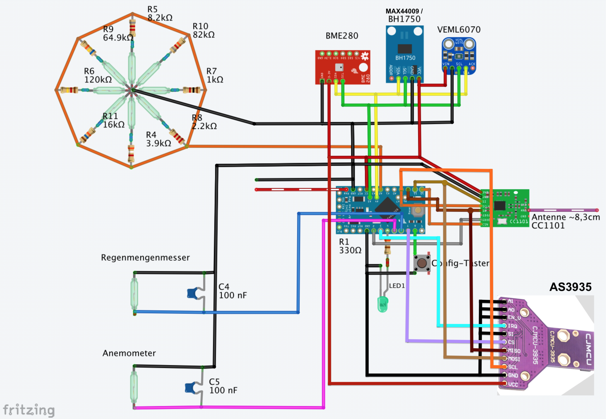
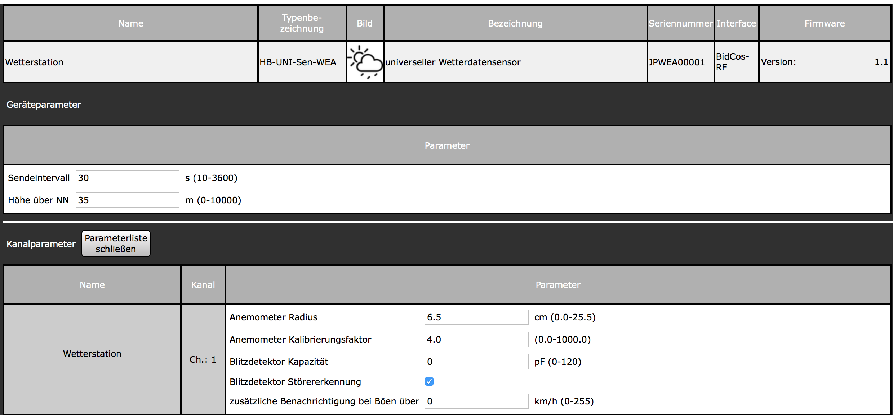

# HB-UNI-Sen-WEA
## Selbstbau-Wetterstation (mit Netzteilbetrieb) für HomeMatic 

 

#### Code
- verwendete Bibliotheken:
  - [BH1750](https://github.com/claws/BH1750) Helligkeitsensor
  - [VEML6070](https://github.com/adafruit/Adafruit_VEML6070) UV Sensor
  - [BME280](https://github.com/finitespace/BME280) Temperatur / Feuchte / Luftdruck

#### Hardware (Elektronik)
- benötigte Bauteile:
  - [CC1101 (868MHz)](https://de.aliexpress.com/item/CC1101-Wireless-Module-Long-Distance-Transmission-Antenna-868MHZ-M115-For-FSK-GFSK-ASK-OOK-MSK-64/32635393463.html) 
  - [Arduino Pro Mini 3.3V/8MHz](https://de.aliexpress.com/item/Free-Shipping-1pcs-pro-mini-atmega328-Pro-Mini-328-Mini-ATMEGA328-3-3V-8MHz-for-Arduino/32342672626.html)
  - [VEML6070](https://www.ebay.de/itm/183207531222)
  - [BME280](https://www.ebay.de/itm/253107395109)
  - [Reed-Kontakte](https://www.ebay.de/itm/263000077321)

#### Gehäuse-/Konstrukt-Teile
Rahmen + Anemometer + Windrichtungszeiger + Regenmengenmesser 
https://www.thingiverse.com/thing:2849562

Halterung für die Platine + Sensoren: 
https://www.thingiverse.com/thing:2821592

Neodym-Magenete: [eBay-Link](https://www.ebay.de/itm/180935986047)  
Kugellager: [eBay-Link](https://www.ebay.de/itm/251368539841)

#### Schaltplan

#### Addon für die CCU / RaspberryMatic

Einstellungen: 

- Sendeintervall
  - Sendeintervall :)
- Altitude
  - Höhe über dem Meeresspiegel (für die barometrische Luftdruckberechnung erforderlich)
- WEATHER|Anemometer Radius (cm)
  - Abstand zwischen Mitte Achse und Mitte Becher
- WEATHER|Anemometer Calibration Factor
  - Multiplikator, um den eigenen Windwiderstand auszugleichen

 Bedienung: 

