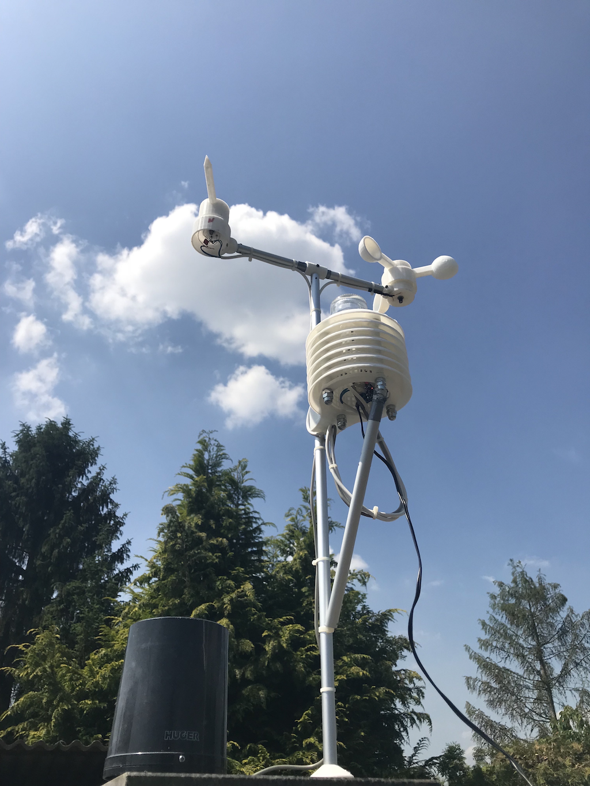

# Selbstbau-Wetterstation (mit Netzteilbetrieb) für HomeMatic   

### Die (garantiert nicht ganz vollständige ;) ) Dokumentation zu dem Projekt befindet sich ab sofort im [Wiki](https://github.com/jp112sdl/HB-UNI-Sen-WEA/wiki)

**Die aktuelle Version des Source-Codes setzt mind. [Addon Version V1.9a](https://github.com/jp112sdl/HB-UNI-Sen-WEA/wiki/Addon) oder höher voraus!**

